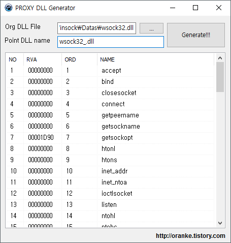

# proxy-dll-generator
...for very simple API Hooking.



This creates a DLL project file for Delphi. It based on the lecture "[Create your Porxy DLLs automatically](http://www.codeproject.com/Articles/16541/Create-your-Proxy-DLLs-automatically )".

## how to use it

Drag DLL file into it and push "Generate!!!" button. That's all.

Take "wsock32.dll" as an example. The output is as follows.

```Delphi
library wsock32;

uses
  Windows, SysUtils;

......


procedure __DLLProc(Reason: Integer);
begin
  case Reason of
    DLL_PROCESS_ATTACH:
    begin
    ......

      OrgFuncs.Arr[0] :=  GetProcAddress(hl, 'accept');
      OrgFuncs.Arr[1] :=  GetProcAddress(hl, 'bind');
      ......
      OrgFuncs.Arr[73] :=  GetProcAddress(hl, 'AcceptEx');
......

// AcceptEx
procedure __E__73__();
asm
  jmp [OrgFuncs.Base + SIZE_OF_FUNC * 73]
end;

......

exports
  __E__73__ index 1141 name 'AcceptEx',
  __E__74__ index 1142 name 'GetAcceptExSockaddrs';

......
```

If you want hook the "AcceptEx" function, Let's change  **\_\_E__73__()** procedure as follows.

```Delphi
// AcceptEx
function __E__73__(sListenSocket, sAcceptSocket: IntPtr;
  lpOutputBuffer: Pointer; dwReceiveDataLength, dwLocalAddressLength,
  dwRemoteAddressLength: DWORD; var lpdwBytesReceived: DWORD;
  lpOverlapped: POverlapped): BOOL; stdcall;
type
  TAcceptEx = function (sListenSocket, sAcceptSocket: IntPtr;
    lpOutputBuffer: Pointer; dwReceiveDataLength, dwLocalAddressLength,
    dwRemoteAddressLength: DWORD; var lpdwBytesReceived: DWORD;
    lpOverlapped: POverlapped): BOOL; stdcall;
begin
  // Do someting with parameters
  // ..........

  // Call the original function
  Result :=
    TAcceptEx(OrgFuncs.Arr[73])(
      sListenSocket, sAcceptSocket,
      lpOutputBuffer, dwReceiveDataLength, dwLocalAddressLength,
      dwRemoteAddressLength, lpdwBytesReceived, lpOverlapped
    );
end;
```

NOTICE: DONT'T USE LOCAL VARIABLES FOR KEEP STACK STRUCTURE!!


## how to build

It was built using Lazarus and requires "[VirtualTreeview-Lazarus](https://github.com/blikblum/VirtualTreeView-Lazarus)".

I tried to use "[pe-image-for-delphi](https://github.com/vdisasm/pe-image-for-delphi)" to get the DLL information, but Lazarus does not support anonymous functions. So I forked it and made "[pe-image-for-Lazarus](https://github.com/oranke/pe-image-for-Lazarus)".
You should copy  "TlHelp32.pas" and "PsAPI.pas" units from Delphi src folder to build it.

Have fun.
